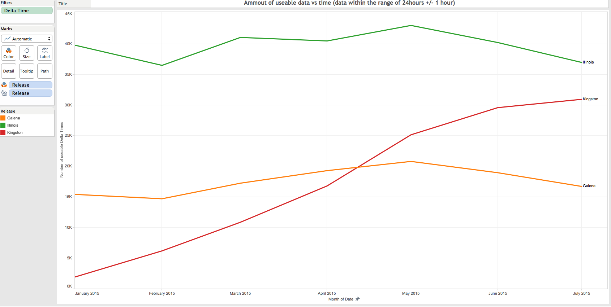

# NetApp

Brian McKean, a senior engineer at NetApp, gave a talk about his company in class.
He shared a data problem for our class to help solve.

# Tool
Tableau

# Authors

This report is prepared by
* [Caleb Hsu](https://github.com/calebhsu/)
* [Andrew Linenfelser](https://github.com/Linenfelser)
* [Zhili Yang](https://github.com/zhya215)
* [Andrey Shprengel](https://github.com/AndreyShprengel)
* [Andrew Berumen](https://github.com/anbe6083)

# What is the distribution of the most common delta times per bin?

Each bin is of size 80,000
# What are the outliers when comparing max and min delta times? 

# Which release did the worst job?

# Are delta times consistent across serial numbers?

# How much useable data (+/- 1 hour) is there?

# Further Analysis

Our team determines the following questions are too complex for Tableau and
require custom scripts to be written.

* (Pick out the system serial numbers that have useable data and return the ones that have consistently accurate data)
* Determine an error range for acceptable delta times to indicate whether a system is reporting according to standards or not.
* Determine the proportion of usable delta time in each release.
* Determine the trend of delta times over time for specific systems
* Determine the cause of poor delta times, whether it be the release, FW version, SW version or controllers
